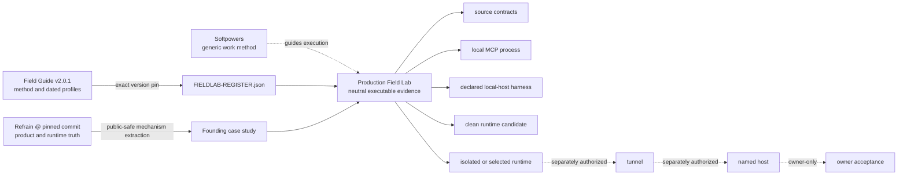
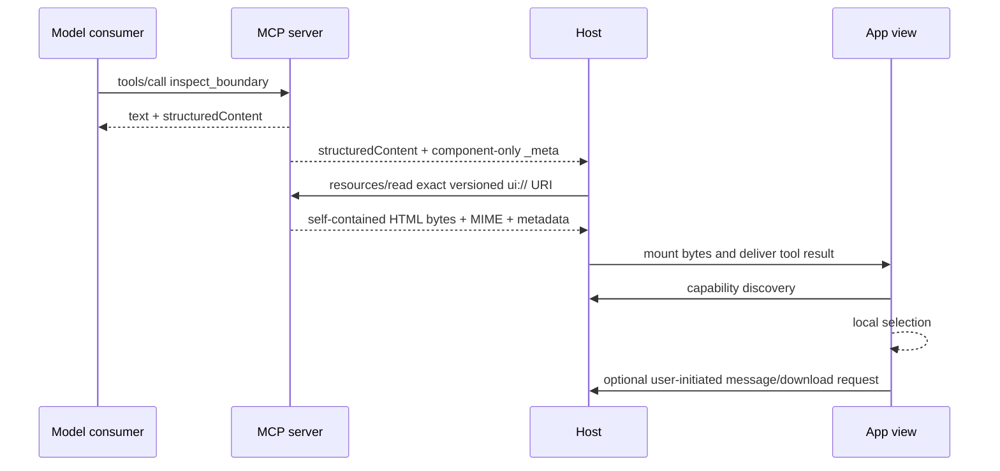

# Architecture

MCP App Production Field Lab 的核心不是多做一套 framework，而是把 authority、execution surface 与 evidence ceiling 固定在同一张图里。Neutral specimen 足够真实，可以走 MCP resource、App bridge、browser sandbox 与 package/runtime paths；又足够小，不把 Refrain 的产品逻辑搬进来。

## Authority topology



The arrows do not transfer authority:

- Field Guide owns method/profile interpretation; the Lab owns executions against an exact selected profile set.
- Softpowers owns general implementation/debug/verification workflow; the Lab supplies MCP App-specific seams and receipts.
- Refrain owns its source, renderer, deployment, runtime and acceptance truth; the case study extracts mechanisms only.
- A local harness owns only its declared observable envelope. It cannot speak for ChatGPT, another named host, host account policy, discovery cache or undocumented behavior.

## Dual-consumer specimen

One `inspect_boundary` invocation serves two consumers without merging their data boundaries:



The server is stateless and read-only. Selection state stays in the view. Optional host effects are not rendered unless their capability is advertised, and a request returning from the bridge is recorded as a request disposition—not as owner acceptance.

## Exact resource boundary

Production resource authority is a single explicit-version URI:

```text
ui://mcp-app-production-fieldlab/inspect-boundary/v1.html
```

The production builder emits JS/CSS artifacts. `src/self-contained-view.ts` reads their exact manifest entries, escapes closing tags, and assembles one HTML document with inline style and module script. The MCP server registers and serves those exact bytes with `text/html;profile=mcp-app` and a zero-domain CSP.

This contract exists because MCP JSON-RPC/resource delivery and iframe asset GETs are different planes. A resource may be discoverable while external scripts, styles, fonts or media remain unreachable. The local MCP smoke must therefore perform `resources/read`; the browser harness must mount those read bytes; unexpected network is evidence of a contract violation.

## Identity graph

The Lab does not use one hash as a universal identity. Each value answers a different question:

| Identity                       | Question                                                                       |
| ------------------------------ | ------------------------------------------------------------------------------ |
| `source_revision`              | Which exact committed source tree was selected?                                |
| resource URI                   | Which versioned MCP App document name was requested?                           |
| resource `sha256` + byte count | Which exact HTML bytes were read and mounted?                                  |
| per-file SHA-256               | Which exact files are in the runtime candidate?                                |
| `bundle_digest`                | Which sorted candidate payload identity was packaged?                          |
| runtime health identity        | Which source revision/bundle does this running process report?                 |
| image/service identity         | Which immutable operator artifact was selected, when such a deployment exists? |

Resource content identity is not source identity. Package identity is not activated-runtime identity. A health response is meaningful only when read from the same origin/process that serves the MCP endpoint under test.

## Evidence model

Scenario contracts live under `scenarios/`; structural receipt authority lives in `src/evidence/receipt.ts` and its generated JSON Schema. Every receipt records:

- exact scenario id/revision and claim text;
- `verified`, `failed`, or `not_verified`;
- one `method_rung` and an explicit `proof_ceiling`;
- subject identities actually used for the decision;
- environment/profile and separately modelled capability disposition;
- optional `confirmed`, `probable`, or `unknown` root-cause confidence, kept separate from claim status;
- observations, evidence references, limitations and non-empty `not_proven`.

A missing observation is `not_verified`, not `failed`, and must carry an exact `not_verified_reason`. A capability can be discovered but rejected; absent, denied, cancelled, policy-denied and technically failed are distinct causal states. A sanitized receipt may preserve a useful result while omitting private raw evidence, but it remains a derived account of that execution.

## Local host harness

The harness uses the MCP Apps bridge and a real iframe lifecycle with three explicit profiles:

- `restricted`: sandbox only; message/download capability is absent.
- `capability-success`: message and download advertised and returned successfully.
- `capability-rejected`: the same capabilities are advertised; download is deliberately rejected so rejection remains distinct from absence.

Its ledger records resource URI/MIME/bytes, initialization sequence, protocol requests, capability discovery/disposition, console/page errors and unexpected network. It sets `namedHostSimulation: false` by contract. Thus a green local harness proves only that the exact App behaves under those declared envelopes; it never proves ChatGPT admission, cache refresh, workspace policy, tunnel state or owner acceptance.

## Package and activation boundary

The package lane is intentionally later than source/process tests:

1. Refuse dirty source and an already-existing output path.
2. Resolve one committed revision.
3. Build in a detached clean worktree with the pinned lockfile.
4. Materialize the runtime-only candidate and sorted per-file identities.
5. Record `release.json` and atomically adopt the candidate path.
6. Copy the candidate into an isolated temporary projection, install production dependencies, start a fresh loopback process, and compare `/healthz` identity with MCP discovery/tool/resource readback.

That isolated process can prove the candidate executes and self-reports consistently. It does not prove an operator installed or selected it as production, nor that a tunnel or named host reaches it.

## Trust and side-effect boundaries

Ordinary local actions include source inspection, build/test, bundled Chromium execution, ignored receipt generation, clean candidate packaging and isolated loopback smoke. The following remain separate gates:

- credential/profile access and tunnel preflight;
- starting/restarting a tunnel or service;
- selecting or deploying an immutable runtime;
- authenticated named-host discovery or interaction;
- recording owner acceptance;
- remote/visibility changes, GitHub or package release publication, and license selection.

Credentials, cookies, private URLs, private conversations/logs and raw owner evidence never enter Git. See [Testing](TESTING.md) and the [tunnel/named-host runbook](runbooks/tunnel-and-named-host.md) for the exact claim ceilings.
